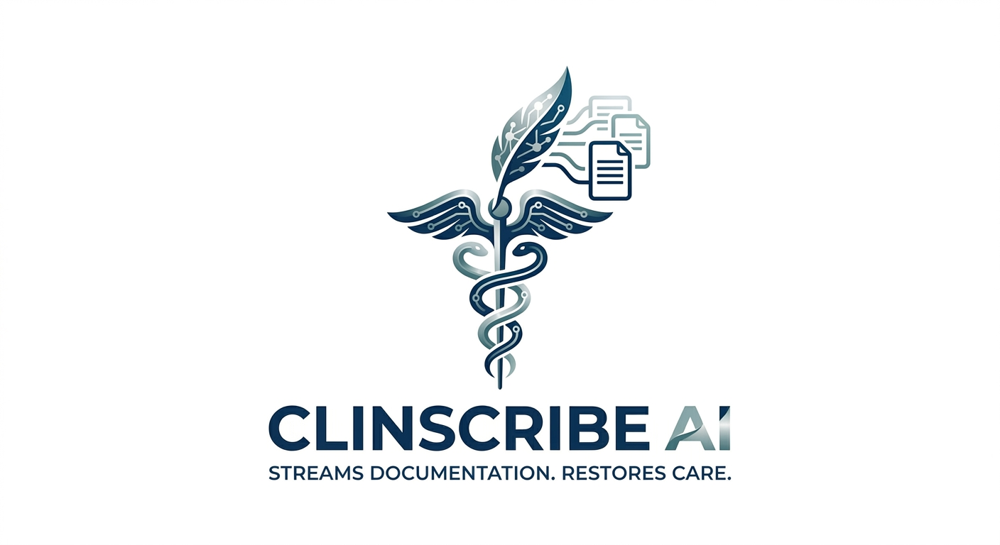
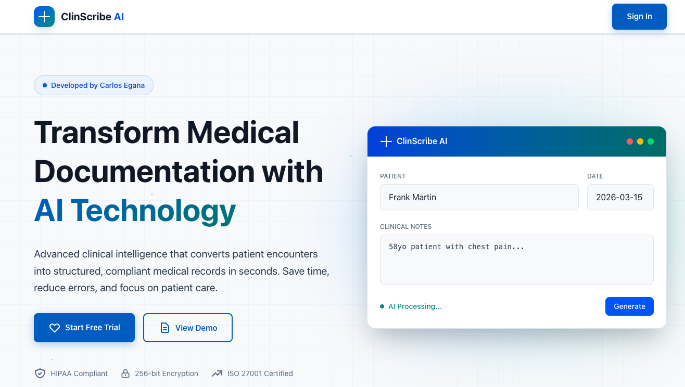
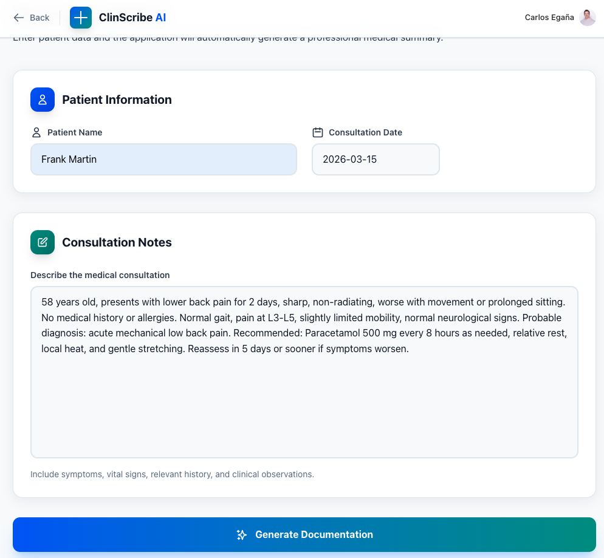
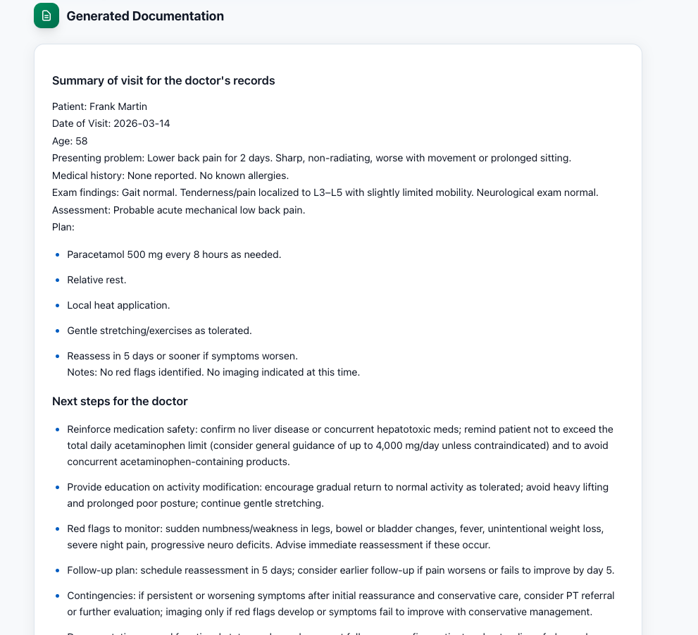
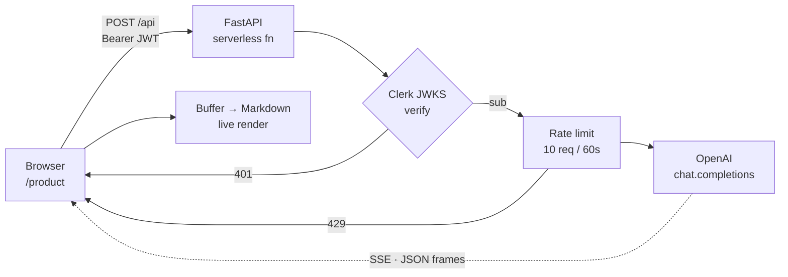

<div align="center">



### The visit is over. The paperwork isn't.

**Every clinician pays the same tax.** The patient walks out, and then comes the second shift —
hours a day retyping what you already know, while the waiting room fills and dinner goes cold.
Documentation has quietly become the reason good clinicians burn out.

**ClinScribe AI hands that time back.** Paste the encounter exactly as you scribbled it —
abbreviations, fragments, vitals and all. Get back a clean visit summary, a prioritized
follow-up list, and a patient-ready message. One pass. You stay the editor.

<br/>

[](https://nextjs.org)
[](https://www.typescriptlang.org)
[](https://fastapi.tiangolo.com)
[](https://platform.openai.com)
[](https://clerk.com)
[](https://vercel.com)

</div>

---

## See it run

Messy notes in. Three finished clinical artifacts out — streamed token by token, in seconds.

<div align="center">
  
</div>

---

## Why this exists

Clinicians didn't train for years to become typists. Yet after every encounter the same ritual
repeats: open a blank field, reconstruct what just happened, and translate it three times over —
once for the chart, once for the care plan, once for the patient. It's repetitive, it's
error-prone when you're tired, and it's the quiet thief of both clinical time and attention.

ClinScribe AI attacks exactly that moment. It takes the messy, real-world notes you already
write and turns them into three finished artifacts in a single streamed pass — so the writing is
done by the time you've read it, and your job shrinks to what it should have been all along:
**reviewing and approving, not retyping.**

---

## How it works

### 1 · Land

A single promise, no onboarding maze. Clinical intelligence that converts encounters into
structured, compliant records — in seconds.

<div align="center">
  
</div>

<br/>

### 2 · Write it the way you actually write it

Patient, date, and the raw note. Fragments, abbreviations, vitals, dosages — no template to
fill, no fields to fight. Notes are bounded at 8 000 characters and treated strictly as data.

<div align="center">
  
</div>

<br/>

### 3 · Get three finished artifacts

The response streams live as Markdown. Same three sections, every single time — the backend
verifies their presence before it closes the stream.

<div align="center">
  
</div>

```
### Summary of visit for the doctor's records
### Next steps for the doctor
### Draft of email to patient in patient-friendly language
```

---

## Architecture

A Next.js frontend and a Python inference endpoint deployed as a single Vercel project.
Auth is verified at the edge of the API, not the client.



| Stage | Detail |
|:--|:--|
| **Transport** | Server-Sent Events. Each frame is JSON-encoded so newlines survive intact. |
| **Auth** | Clerk JWT verified server-side against the JWKS endpoint. `sub` becomes the rate-limit key. |
| **Validation** | Pydantic bounds every field. Notes cap at 8 000 characters. |
| **Guardrail** | Patient notes are treated strictly as data — embedded instructions are summarized, never executed. |
| **Contract** | The final frame reports whether all three required sections were produced. |

---

## Output contract

**Request**

```jsonc
POST /api
Authorization: Bearer <clerk_jwt>

{ "patient_name": "…", "date_of_visit": "2026-08-15", "notes": "…" }
```

**Stream**

```jsonc
data: { "text": "### Summary of visit…" }        // n frames
data: { "done": true, "valid": true, "missing_sections": [] }
data: { "error": "AI service error. Please try again." }   // terminal, on failure
```

---

## Stack

| Layer | Technology |
|:--|:--|
| **Frontend** | Next.js · TypeScript · Tailwind CSS |
| **Motion** | GSAP + ScrollTrigger — pinned scroll-telling, parallax, stagger |
| **Backend** | FastAPI · Pydantic — Vercel Python runtime |
| **Inference** | OpenAI `gpt-4o-mini`, streamed |
| **Identity** | Clerk — JWT + JWKS, plan-gated routes |
| **Delivery** | Vercel — CI on push to `main` |

---

## Quick start

```bash
git clone https://github.com/carloseganac/ClinScribe-AI.git
cd ClinScribe-AI
npm install
```

Configure both halves:

```bash
cp env.local.example .env.local     # NEXT_PUBLIC_CLERK_PUBLISHABLE_KEY, CLERK_SECRET_KEY
cp api/.env.example api/.env        # OPENAI_API_KEY, CLERK_JWKS_URL
```

```bash
npm run dev     # → http://localhost:3000
```

<details>
<summary><b>Backend configuration</b></summary>

<br/>

| Variable | Default | Purpose |
|:--|:--|:--|
| `OPENAI_API_KEY` | — | Required |
| `CLERK_JWKS_URL` | — | Required · JWT signature verification |
| `OPENAI_MODEL` | `gpt-4o-mini` | Inference model |
| `OPENAI_TIMEOUT` | `60` | Seconds |
| `RATE_LIMIT_MAX` | `10` | Requests per window, per user |
| `RATE_LIMIT_WINDOW` | `60` | Window, in seconds |

</details>

---

## Engineering notes

- **SSE framing** — chunks are JSON-encoded rather than raw. Plain SSE collapses `\n`, which
  would destroy Markdown structure mid-stream.
- **Rate limiting** — currently in-memory, so it holds only within a warm serverless instance.
  A shared store (Upstash Redis) is the path to true multi-instance limiting.
- **Prompt injection** — the system prompt pins notes as clinical data. Commands found inside
  a note are reported as content, not obeyed.
- **Overlay clipping** — the date picker renders through a portal so it escapes the card's
  containing block instead of being clipped by it.

---

## Status

**Public beta** · under active development.

> Consultation notes are sent to an external AI service to generate output. This is **not a
> certified or HIPAA-compliant medical service** and must not be used for care.
> **Do not enter real protected health information (PHI).**

---

<div align="center">
<sub>Built by <a href="https://github.com/carloseganac">Carlos Egaña</a></sub>
</div>
